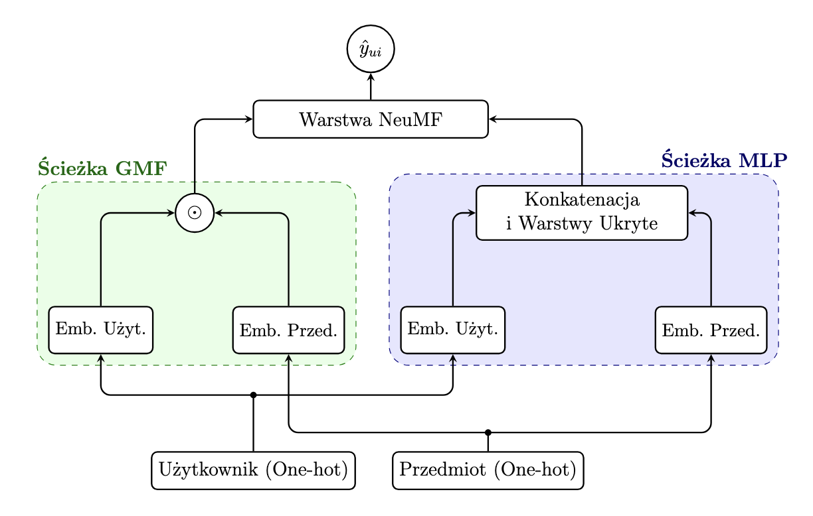
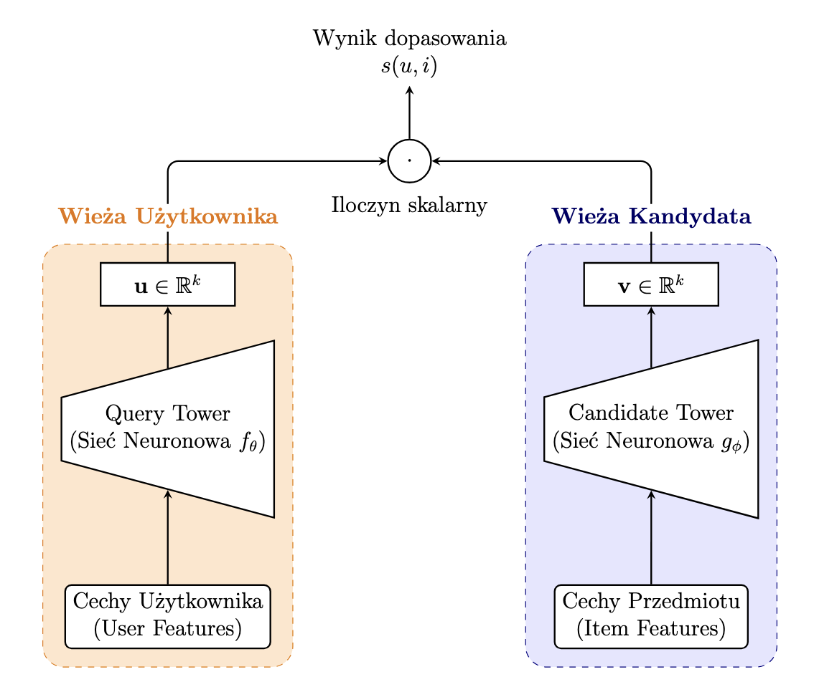
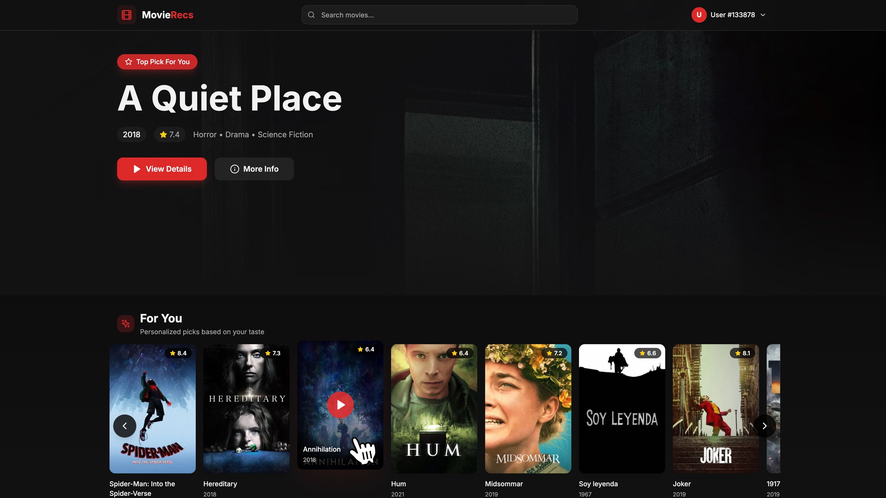
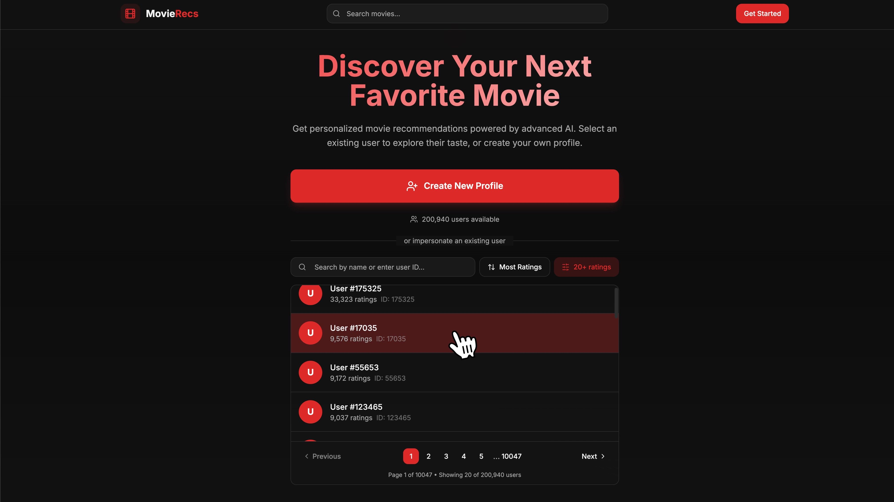
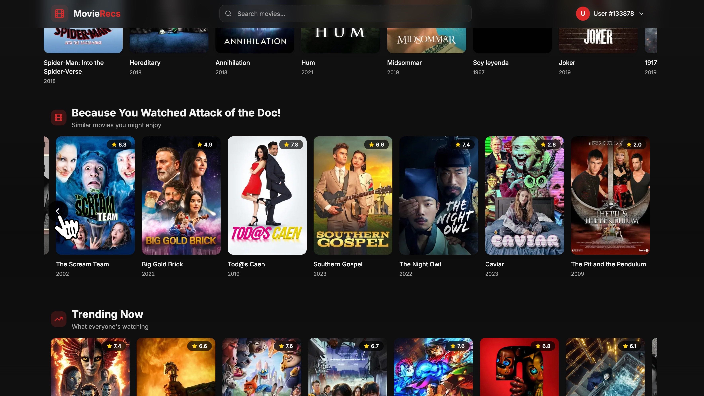
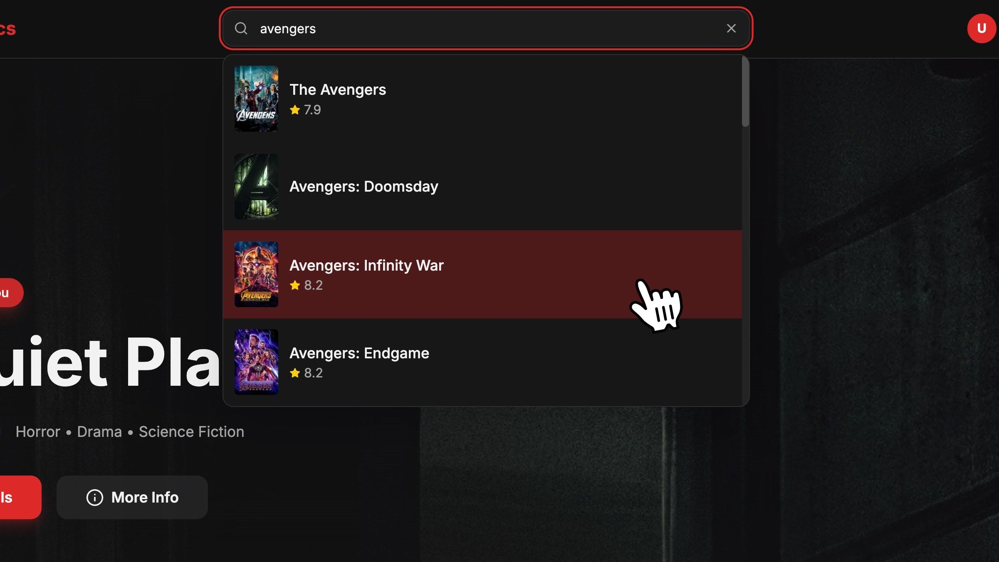
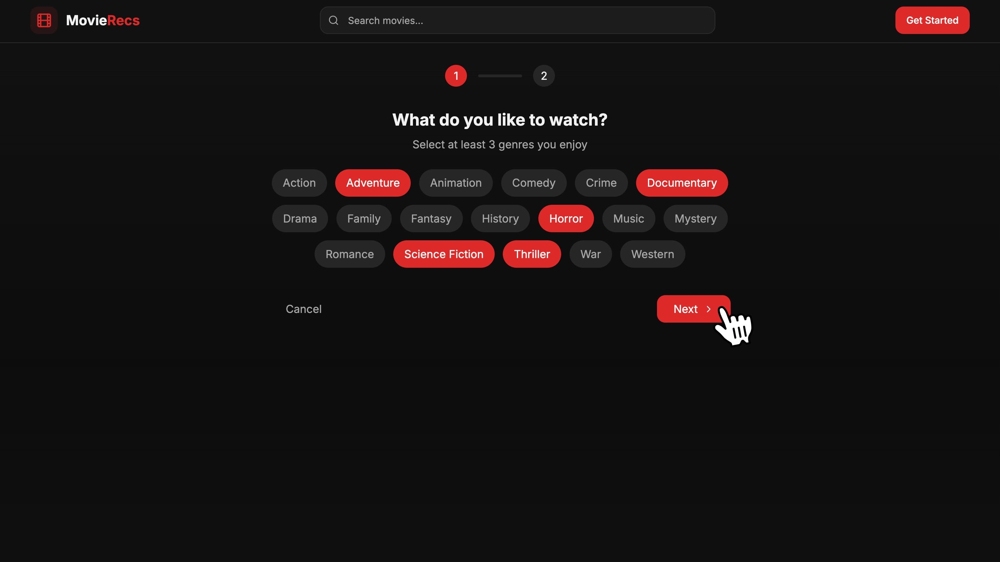
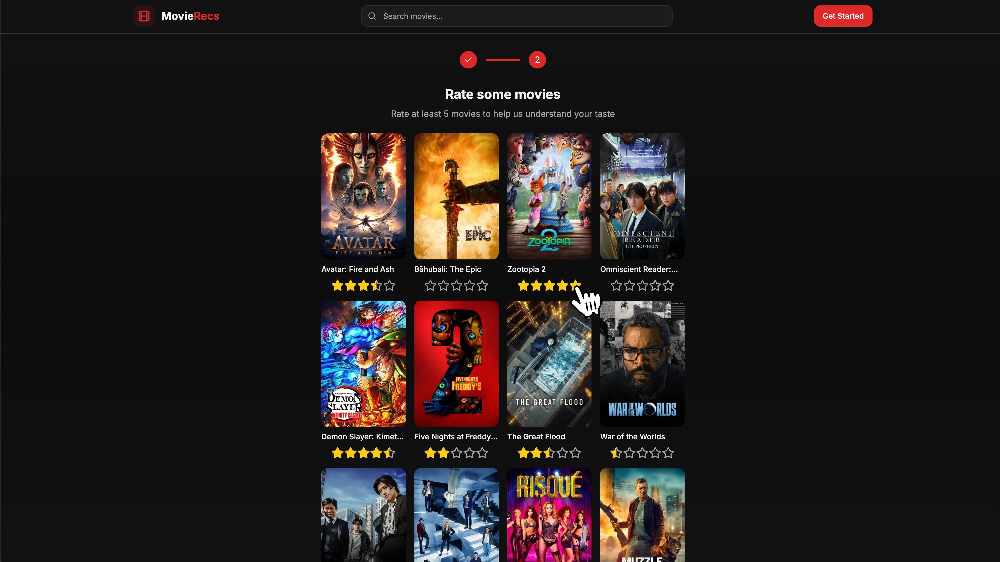
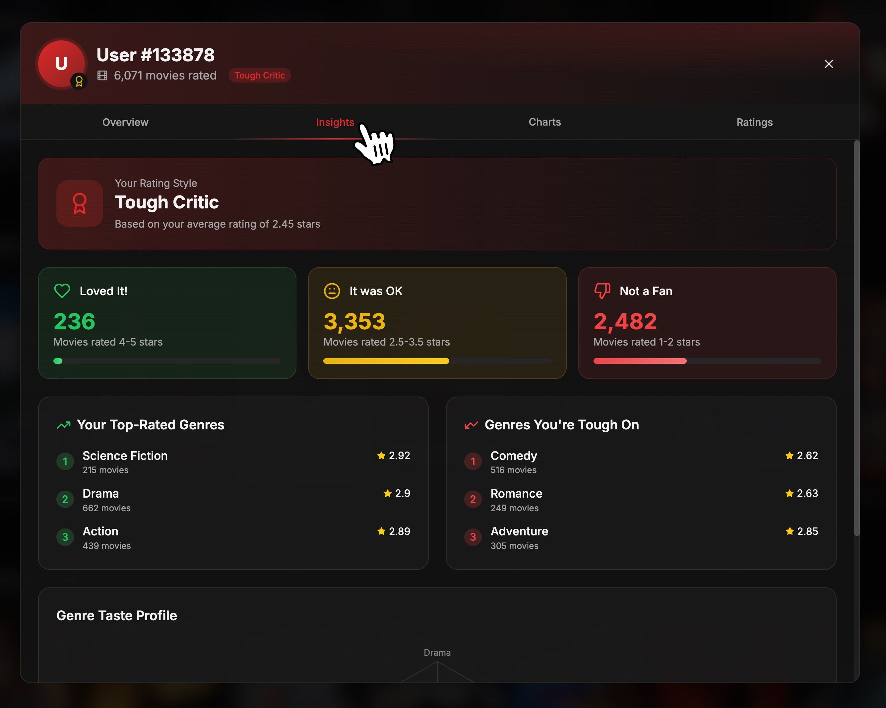
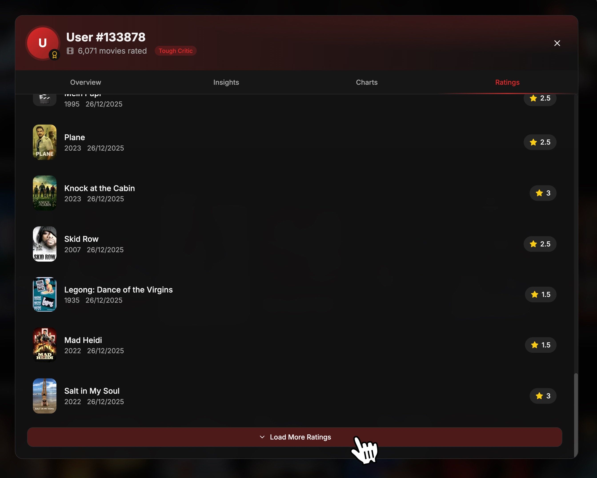

# Thesis and Results

## Abstract

This thesis presents a comprehensive comparative study of five movie recommendation algorithms, culminating in the development of a production-ready Two-Tower neural network model. The following methods were implemented and evaluated: collaborative filtering (SVD), content-based filtering using BERT language model, k-nearest neighbors (KNN), neural collaborative filtering (NCF), and the Two-Tower model.

Using the MovieLens 32M dataset (32 million ratings from 200,948 users on 87,585 movies) enriched with TMDB metadata, we demonstrate that the Two-Tower model achieves superior ranking performance with NDCG@10 of 0.607 and Recall@20 of 0.718, outperforming all baseline methods by 38.3%. The Two-Tower architecture also addresses the cold-start problem through a content-only tower that enables recommendations for 650,000 movies without rating history.

A full-stack web application was developed to demonstrate the production deployment of the model, utilizing TensorFlow Serving for real-time inference and Qdrant vector database for approximate nearest neighbor search with sub-10ms latency.

## Used Datasets

-   MovieLens 32M

-   TMDB 2023

### Data Enrichment

The MovieLens dataset was enriched with TMDB metadata, resulting in:

-   80,000 movies with full interaction history (MovieLens)
-   570,000 movies with content-only embeddings (TMDB)
-   Total catalog: 650,000 movies

## Implemented Models

1. Collaborative Filtering (SVD)
2. Content-Based Filtering
3. K-Nearest Neighbors (KNN)
4. Neural Collaborative Filtering (NCF)
5. Two-Tower Model

## Neural Collaborative Filtering (NCF) Model Architecture

## Two-Tower Model Architecture

### Training Configuration

| Model         | Epochs | Batch Size | Training Time |
| ------------- | ------ | ---------- | ------------- |
| SVD           | 100    | --         | ~10 min       |
| Content-Based | --     | 64         | ~1 hour       |
| KNN           | --     | --         | ~30 min       |
| NCF           | 100    | 256        | ~6 hours      |
| Two-Tower     | 100    | 4096       | ~6.5 hours    |

### Evaluation Methodology

**Bootstrap Evaluation** (N=1000 iterations):

-   Random sampling with replacement from 185,049 test users
-   100 random recommendation lists per user
-   Mean and standard deviation calculation for all metrics

**Test Set**: 3.2 million ratings held out from training

**Predictive Set**: 3.2 million ratings used for validation

**Threshold**: Ratings ≥ 4.0 considered positive (relevant)

## Results

### Rating Prediction Metrics on Predictive Set

Models optimized for rating prediction (lower is better):

| Model         | RMSE     | MAE      |
| ------------- | -------- | -------- |
| SVD           | 0.87     | 0.68     |
| Content-Based | 0.92     | 0.71     |
| KNN           | 0.85     | 0.66     |
| **NCF**       | **0.79** | **0.61** |
| Two-Tower     | --       | --       |

_Note: Two-Tower is optimized for ranking, not rating prediction_

## Test Set Metrics

**Key Findings**:

-   NCF achieves best rating prediction accuracy
-   Content-based filtering performs worst (content alone insufficient)
-   KNN slightly outperforms SVD

### Ranking Metrics

#### Precision@K

Percentage of recommended items that are relevant (higher is better):

| Model         | P@5               | P@10              | P@20              |
| ------------- | ----------------- | ----------------- | ----------------- |
| SVD           | 0.284 ± 0.001     | 0.193 ± 0.001     | 0.111 ± 0.001     |
| Content-Based | 0.228 ± 0.001     | 0.151 ± 0.001     | 0.084 ± 0.001     |
| KNN           | 0.308 ± 0.001     | 0.212 ± 0.001     | 0.124 ± 0.001     |
| NCF           | 0.362 ± 0.001     | 0.253 ± 0.001     | 0.151 ± 0.001     |
| **Two-Tower** | **0.408 ± 0.001** | **0.288 ± 0.001** | **0.174 ± 0.001** |

#### Recall@K

Coverage of relevant items (higher is better):

| Model         | R@5               | R@10              | R@20              |
| ------------- | ----------------- | ----------------- | ----------------- |
| SVD           | 0.387 ± 0.001     | 0.488 ± 0.001     | 0.539 ± 0.001     |
| Content-Based | 0.321 ± 0.001     | 0.402 ± 0.001     | 0.437 ± 0.001     |
| KNN           | 0.413 ± 0.001     | 0.523 ± 0.001     | 0.580 ± 0.001     |
| NCF           | 0.469 ± 0.001     | 0.591 ± 0.001     | 0.659 ± 0.001     |
| **Two-Tower** | **0.514 ± 0.001** | **0.644 ± 0.001** | **0.718 ± 0.001** |

#### NDCG@K

Normalized Discounted Cumulative Gain - position-weighted ranking quality (higher is better):

| Model         | NDCG@5            | NDCG@10           | NDCG@20           |
| ------------- | ----------------- | ----------------- | ----------------- |
| SVD           | 0.426 ± 0.001     | 0.439 ± 0.001     | 0.445 ± 0.001     |
| Content-Based | 0.350 ± 0.001     | 0.358 ± 0.001     | 0.360 ± 0.001     |
| KNN           | 0.459 ± 0.001     | 0.473 ± 0.001     | 0.481 ± 0.001     |
| NCF           | 0.530 ± 0.001     | 0.547 ± 0.001     | 0.557 ± 0.001     |
| **Two-Tower** | **0.590 ± 0.001** | **0.607 ± 0.001** | **0.620 ± 0.001** |

#### Mean Reciprocal Rank (MRR)

Average reciprocal rank of first relevant item (higher is better):

| Model         | MRR               |
| ------------- | ----------------- |
| SVD           | 0.599 ± 0.001     |
| Content-Based | 0.521 ± 0.001     |
| KNN           | 0.629 ± 0.001     |
| NCF           | 0.692 ± 0.001     |
| **Two-Tower** | **0.741 ± 0.001** |

### Improvement Over Baseline

Relative improvement compared to SVD (baseline):

| Model         | Δ NDCG@10  | Δ Recall@20 | Δ MRR      |
| ------------- | ---------- | ----------- | ---------- |
| Content-Based | -18.5%     | -18.9%      | -13.0%     |
| KNN           | +7.7%      | +7.6%       | +5.0%      |
| NCF           | +24.6%     | +22.3%      | +15.5%     |
| **Two-Tower** | **+38.3%** | **+33.2%**  | **+23.7%** |

## Cold-Start Analysis

### Content-Only Tower Performance

For movies without rating history, the Content-Only Tower (BERT-only) achieves:

| Configuration        | NDCG@10       | Recall@20     | MRR           |
| -------------------- | ------------- | ------------- | ------------- |
| Two-Tower (full)     | 0.607 ± 0.001 | 0.718 ± 0.001 | 0.741 ± 0.001 |
| Content-Only Tower   | 0.473 ± 0.001 | 0.580 ± 0.001 | 0.629 ± 0.001 |
| **Performance Drop** | **-22%**      | **-19%**      | **-15%**      |

**Key Insight**: Content-Only Tower achieves NDCG@10 = 0.473, comparable to KNN (0.473), enabling recommendations for 570,000 TMDB movies without interaction history.

## Discussion

### Why Two-Tower Performs Best

1. **Hybrid Signals**: Combines collaborative (interactions) and content (BERT) information
2. **Retrieval Optimization**: Softmax loss with in-batch negatives directly optimizes ranking
3. **Rich Representations**: 128-dimensional embeddings encode complex preferences

### NCF as Alternative

NCF achieves:

-   Best rating prediction (RMSE = 0.79)
-   Second-best ranking performance
-   Good choice when exact rating prediction is priority

### Content-Based Limitations

Weak performance confirms that content features alone are insufficient. Different users may have different preferences for movies with similar descriptions.

### Practical Recommendations

1. **Production Systems**: Two-Tower for best ranking quality, cold-start handling, and scalability
2. **Prototyping**: SVD as fast baseline for concept validation
3. **Interpretability**: KNN when recommendation explanations are required
4. **Rating Prediction**: NCF when exact rating accuracy is priority

## Application Screenshots

### Landing Page

### Personalized Recommendations

### User Impersonation

### Contextual Recommendations

### Movie Details with Similar Movies

### Search Interface

### Cold-Start Onboarding

### User Analytics Dashboard

